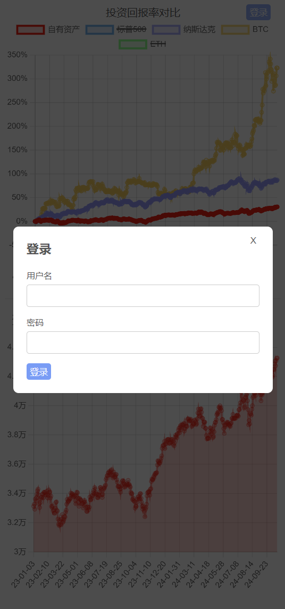
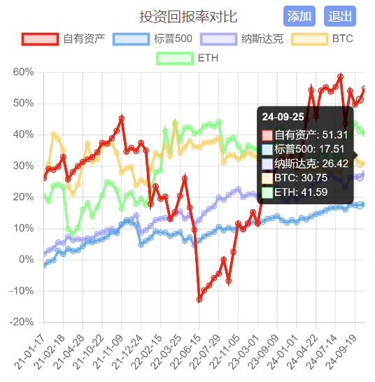
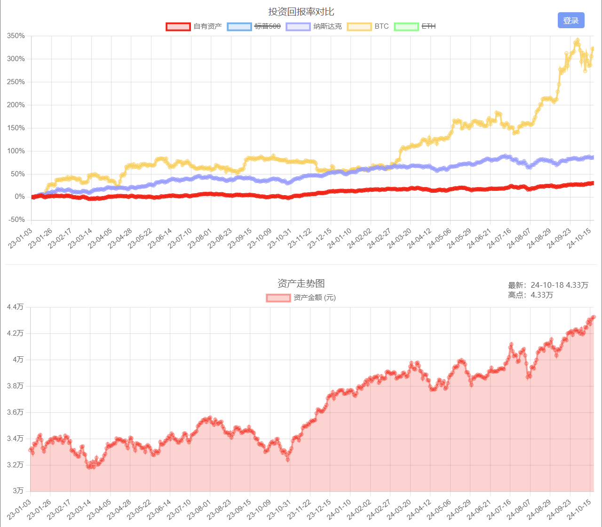
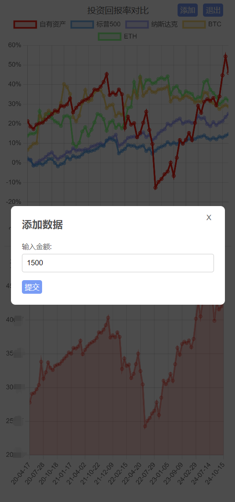

### **个人资产记录 APP**

本项目是一个 Web 应用，允许用户随时间追踪自己的个人资产。用户可以记录资产数据，应用会通过图表显示资产的变化趋势，并将其与 **NASDAQ、S&P 500、比特币（BTC）、以太坊（ETH）等市场指数** 进行对比分析。

**Demo:** <a href="https://nextjs-chartjs-postgres-assets.vercel.app">https://nextjs-chartjs-postgres-assets.vercel.app</a>

---

## **功能特点**

- **个人资产的添加、更新与追踪**：用户可以记录特定时间的资产数据，并随时更新。
- **用户认证与授权**：采用 **JWT 令牌** 进行用户认证，确保只有已登录用户可以查看和管理自己的资产数据，访客则只能浏览示例数据。
- **资产数据可视化**：利用 **Chart.js** 绘制资产走势，提供直观的数据分析。
- **实时数据更新**：资产记录的添加和更新会实时反映在图表中。
- **数据缩放与平移**：用户可以在图表上缩放和拖动，以查看不同时间段的资产变化。
- **访客模式**：未登录用户可查看示例数据，无需注册即可体验应用。
- **资产记录的便捷录入**：通过弹窗（Modal）表单录入新资产数据，界面简洁易用。
- **令牌验证**：应用会在页面加载时自动验证用户令牌，确保会话一致性。
- **错误处理**：提供友好的错误提示，避免用户因数据输入错误或网络问题导致体验下降。
- **响应式设计**：针对 **移动端与桌面端** 进行了优化，确保良好的用户体验。
- **市场表现对比**：通过 **Yahoo Finance API** 获取 **NASDAQ、S&P 500、BTC、ETH** 等市场数据，并与用户的资产收益率进行对比分析。

---

## **技术栈**

本项目采用了以下技术：

- **Next.js 14**：基于 React 的全栈 Web 框架，支持服务器端渲染（SSR）。
- **React.js**：用于构建用户界面。
- **TypeScript**：增强代码可读性，提高开发效率。
- **Tailwind CSS**：快速开发响应式 UI 组件。
- **Material-UI**：实现 Material Design 风格的 UI 组件库。
- **Chart.js**：用于绘制资产走势的可视化图表。
- **PostgreSQL**：强大的开源关系型数据库，存储用户资产数据。
- **JWT（JSON Web Tokens）**：用于用户身份验证与安全管理。
- **React Query**：高效的数据获取和状态管理方案，优化 API 请求。
- **Zod**：数据验证库，确保输入数据格式正确。
- **Vercel**：用于前端托管和部署 Next.js 应用。

---

## **项目截图**

<br/>
<br/>
<br/>
<br/>

---

## **环境要求**

在开始之前，请确保你的系统已经安装了以下工具：

- **Node.js (>= 16.x)**
- **PostgreSQL (>= 12.x)**
- **Git**

---

## **如何启动项目**

### **1. 克隆项目**

```bash
git clone https://github.com/enlian/nextjs-chartjs-postgres-assets.git
cd nextjs-chartjs-postgres-assets
```

### **2. 安装依赖**

```bash
npm install
```

### **3. 配置环境变量**

在项目根目录创建 `.env.local` 文件，并设置 PostgreSQL 连接信息与 JWT 认证参数：

```bash
POSTGRES_USER=your_db_user
POSTGRES_PASSWORD=your_db_password
POSTGRES_HOST=your_db_host
POSTGRES_PORT=your_db_port
POSTGRES_DATABASE=your_db_name

JWT_SECRET=your_jwt_secret    # JWT 令牌签名密钥
ADMIN_USER=your_admin_username  # 管理员账号
ADMIN_PASSWORD=your_admin_password  # 管理员密码
```

### **4. 设置数据库**

连接 PostgreSQL，并运行以下 SQL 语句创建数据库表：

```sql
CREATE TABLE assets (
  date BIGINT NOT NULL,   -- 记录时间（Unix 时间戳）
  amount BIGINT NOT NULL  -- 资产金额
);
```

### **5. 启动开发服务器**

```bash
npm run dev
```

打开浏览器，访问 [http://localhost:3000](http://localhost:3000) 体验应用。

---

## **使用方式**

### **用户认证**

- **登录**：使用弹窗输入用户名和密码进行登录。登录成功后，JWT 令牌会存储在本地存储中。
- **令牌验证**：应用会在每次页面加载时自动验证 JWT 令牌，确保用户会话的连续性。

### **记录资产数据**

1. **已登录用户**：
   - 登录后，点击 **"Add Asset"** 按钮，弹出录入表单。
   - 输入金额并提交，数据会自动保存并实时更新图表。
2. **访客模式**：
   - 未登录用户可浏览示例数据，但无法添加或编辑资产记录。

### **数据可视化**

- **资产走势图表**：显示资产历史趋势，可使用鼠标滚轮缩放，或拖动查看特定时间段的数据。
- **市场数据对比**：与 **NASDAQ、S&P 500、BTC、ETH** 进行对比，查看资产收益表现。

---

## **部署**

### **1. 使用 Vercel 部署**

Next.js 应用可以直接部署到 **Vercel**，操作步骤：

1. 在 [Vercel](https://vercel.com) 创建账户。
2. 连接 GitHub 并导入该仓库。
3. 在 Vercel 控制台中配置环境变量（与 `.env.local` 一致）。
4. 点击部署，即可完成上线。

### **2. 其他部署方式**

本项目也可以部署到支持 Node.js 的云服务器，如：

- **AWS（Amazon Web Services）**
- **Heroku**
- **DigitalOcean**
- **Docker 容器化部署**

确保环境变量配置正确，并能连接到 PostgreSQL 数据库。

---

## **未来优化**

- **增加资产分类功能**：允许用户对不同类型的资产（股票、基金、房产等）进行分类管理。
- **支持多种货币单位**：用户可以选择不同货币进行资产统计。
- **更丰富的市场数据源**：添加更多市场指数，如黄金、原油、ETF 等。
- **定期资产提醒**：设置定期提醒，帮助用户养成资产管理的习惯。

---

## **许可证**

本项目基于 **MIT 许可证** 开源，详细信息请查看 [LICENSE](LICENSE) 文件。
