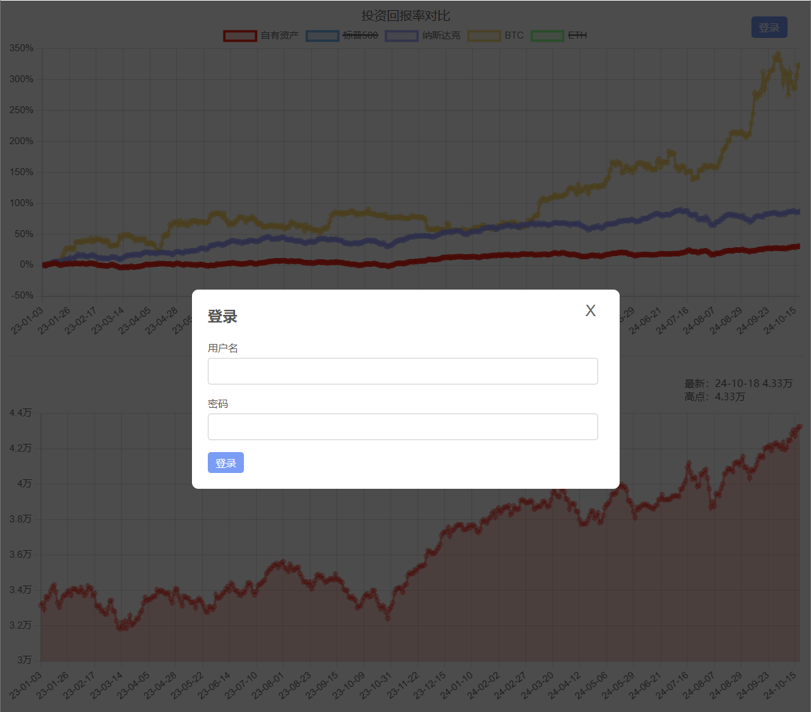

# Personal Net Worth Tracker

This project is a web application designed to help users track their personal net worth over time. Users can record their assets, and the application will display the data in a chart to visualize the growth or decline of their assets.
<br/><br/>
Demo: <a href="https://nextjs-chartjs-postgres-assets.vercel.app">https://nextjs-chartjs-postgres-assets.vercel.app</a>

## Features

- **Add, update, and track personal net worth**: Users can log asset values at different points in time.
- **Authentication and Authorization**: User authentication is implemented using JWT tokens. Only logged-in users can view their personal data, while visitors can see sample data.
- **Visualize net worth data**: Data is displayed in a chart using Chart.js to show the historical performance of assets.
- **Real-time updates**: Add or update asset records, and the chart automatically reflects the changes.
- **Data zooming and panning**: Users can zoom and pan the chart to better view specific ranges of time.
- **Visitor mode**: Visitors can view sample data without logging in.
- **Add new assets using a modal**: A modal form is used to add new asset records, making the interface cleaner and more user-friendly.
- **Token validation**: User tokens are validated with each page load to ensure session integrity.
- **Error handling**: Friendly error messages are displayed in case of failed requests or invalid data inputs.
- **Mobile and Desktop Responsiveness**: The interface is optimized to work seamlessly across mobile devices and desktop browsers.

## Tech Stack

The project uses the following technologies:

- **Next.js 14**: A React-based framework for server-side rendering and building web applications.
- **PostgreSQL**: A powerful, open-source object-relational database system used to store the asset data.
- **Chart.js**: A flexible JavaScript charting library used for data visualization.
- **React.js**: A JavaScript library for building user interfaces.
- **Sass**: CSS preprocessor to make the styles more manageable.
- **Node.js**: For server-side logic, particularly for API routes and database interaction.
- **JWT (JSON Web Tokens)**: Used for secure user authentication and session management.

## Screenshots

<br/>
<br/>
<br/>
<br/>
<br/>

## Prerequisites

Before you begin, make sure you have the following installed on your system:

- Node.js (>= 16.x)
- PostgreSQL (>= 12.x)
- Git

## Getting Started

### 1. Clone the Repository

```bash
git clone https://github.com/enlian/nextjs-chartjs-postgres-assets.git
cd nextjs-chartjs-postgres-assets
```

### 2. Install Dependencies

```bash
npm install
```

### 3. Configure Environment Variables

Create a `.env.local` file in the root of the project and set the following environment variables for your PostgreSQL connection and JWT token handling:

```bash
POSTGRES_USER=your_db_user
POSTGRES_PASSWORD=your_db_password
POSTGRES_HOST=your_db_host
POSTGRES_PORT=your_db_port
POSTGRES_DATABASE=your_db_name

JWT_SECRET=your_jwt_secret    # Secret used for JWT token signing
ADMIN_USER=your_admin_username  # Admin username
ADMIN_PASSWORD=your_admin_password  # Admin password
```

### 4. Set Up the Database

Create the necessary tables in PostgreSQL. Connect to your PostgreSQL instance and run the following SQL command:

```sql
CREATE TABLE assets (
  date BIGINT NOT NULL,   -- Unix timestamp
  amount BIGINT NOT NULL  -- Asset amount
);
```

### 5. Run the Development Server

```bash
npm run dev
```

Open [http://localhost:3000](http://localhost:3000) in your browser to see the application.

## New Features

### 1. **JWT Authentication**:
   - **Login**: Users can log in via the `/api/login` endpoint by providing a username and password. On successful login, a JWT token is returned.
   - **Token validation**: Tokens are automatically validated upon page load. If a token is invalid or expired, it is removed from local storage, and the user is logged out.
   - **Visitor mode**: If a user is not logged in, they are presented with sample data.

### 2. **Modal-based Asset Entry**:
   - A clean modal interface allows users to enter new asset data without leaving the page. This modal supports dynamic form validation.

### 3. **Error Handling**:
   - Errors during data fetching, token validation, or form submission are handled gracefully, with clear error messages displayed to the user.

### 4. **Zoom and Pan in Charts**:
   - The Chart.js plugin allows users to zoom in on data points and pan across different date ranges, providing a more interactive experience.

### 5. **Mobile and Desktop Responsiveness**:
   - The interface has been optimized for both mobile devices and desktop browsers, ensuring a seamless experience across all platforms.

## Deployment

### Vercel Deployment

You can deploy this Next.js project directly to [Vercel](https://vercel.com), which is the easiest way to deploy a Next.js app.

1. Create an account on Vercel.
2. Import your GitHub repository into Vercel.
3. Set up environment variables for your PostgreSQL connection and JWT secret in the Vercel dashboard (same as the `.env.local` file).
4. Deploy the project.

### Other Deployment Options

You can also deploy this project to any platform that supports Node.js (e.g., AWS, DigitalOcean, Heroku). Ensure that your environment variables are properly set up, and PostgreSQL is connected.

## Usage

### Authentication and Authorization
- **Login**: Log in using the modal. Upon successful login, a JWT token is stored in the browser’s local storage.
- **Token Validation**: Tokens are validated on each page load. If the token is valid, users are automatically logged in; otherwise, the token is cleared and users are logged out.

### Adding New Records
1. **Logged-in users**: After logging in, click on the "Add Asset" button to open a modal form.
2. **Visitor mode**: View sample data without needing to log in.

### Viewing Data
- **Charts**: The home page displays a historical chart of your net worth. You can zoom in and out using your mouse wheel and pan across the chart.

## License

This project is licensed under the MIT License. See the [LICENSE](LICENSE) file for more details.
